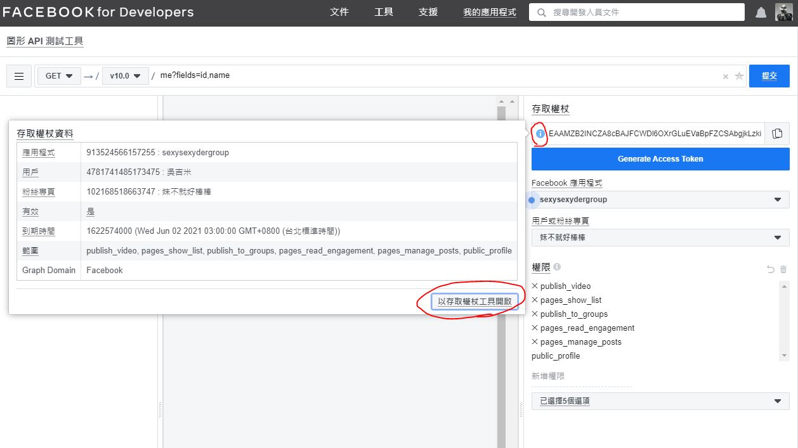

# sexysexyDer 
> 妹不就好棒棒IG抓突發文工具


## 初始化專案
### 安裝套件
```bash
pip3 install -r requirements.txt
```
### IG登入授權
```bash
instaloader --login={IG帳號} --sessionfile={IG session檔案路徑}
```
> 不從程式登入因為我的帳號有設定簡訊2階段驗證，先用指令來登入保存session之後 程式只要load session 就好 。

### 系統變數
- `IG_USERNAME` 登入IG的帳號
- `IG_SESSION_FILE`  IG登入後session保存路徑[參考](#IG登入授權) 
- `FB_PAGE_ID` Facebook 粉專ID
- `FB_GROUP_ID` Facebook 社團ID
- `FB_ACCESS_TOKEN` 存取權杖[參考](#FB存取權杖) 
> 要先確認`.env` 內容當中的`FB_ACCESS_TOKEN`否過期


## 執行專案

### 一般執行
在`.env`所在的目錄執行即可
```bash
python3 src/app.py
```

### docker 執行
1. 啟動容器背景執行
    ```bash
    docker run  -d -p 5000:5000  --name sexysexyder-bot --env-file ./.env -v $PWD/logs:/usr/app/logs -v $PWD/downloads:/usr/app/downloads sexysexyder
    ```

2. 啟動容器並且進入容器操作
    ```bash
    docker run -it -p 5000:5000 --name sexysexyder-bot --env-file ./.env -v $PWD/logs:/usr/app/logs -v $PWD/downloads:/usr/app/downloads sexysexyder /bin/bash
    ```
3. 參數說明
    1. `--env-file` 啟動容器時帶入`.env` 環境變數檔案
    2. `-v $PWD/logs:/usr/app/logs` 掛載Volumn保存log檔案
    3. `-v $PWD/downloads:/usr/app/downloads` 掛載Volumn保存IG 所下載檔案
#### docker 其他指令
1. 建構Image
    ```bash
    docker build -t sexysexyder .
    ```
2. 停止容器
    ```bash
    docker container stop sexysexyder-bot
    ``` 
2. 移除容器
    ```bash
    docker container rm sexysexyder-bot 
    ``` 


## FB存取權杖
### 取得臨時存取權杖
1. 進入FB 圖形 API 測試工具頁面 [連結](https://developers.facebook.com/tools/explorer/913524566157255/)
2. 用戶或粉絲專頁 選取 粉絲專業存取權杖(妹不就好棒棒)<br>


### 取得永久存取權杖
1. 參考  [取得臨時存取權杖](#取得臨時存取權杖) 選取存取權杖
2. 檢視存取權杖資料 <br>
3. 延伸存取權杖<br>


docker run -d -p 5672:5672 -p 15672:15672 -v <log-dir>:/data/log -v <data-dir>:/data/mnesia ronnyroos/rpi-rabbitmq